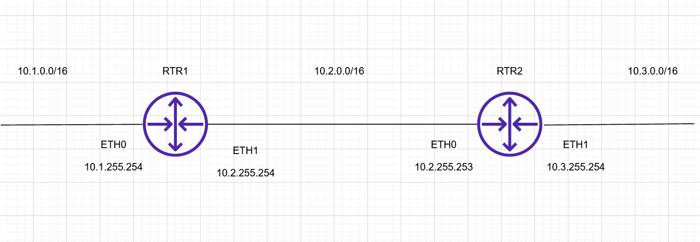
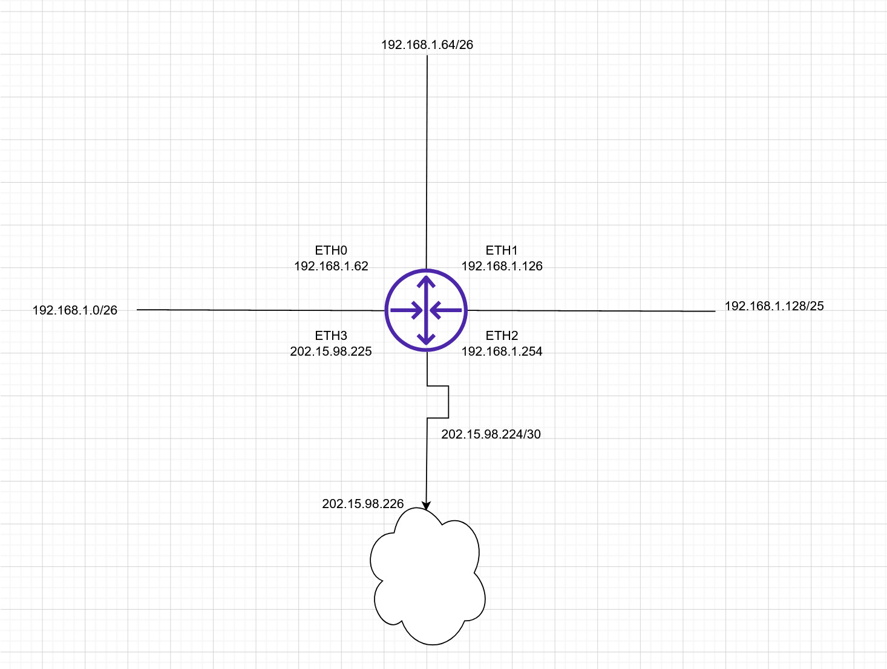
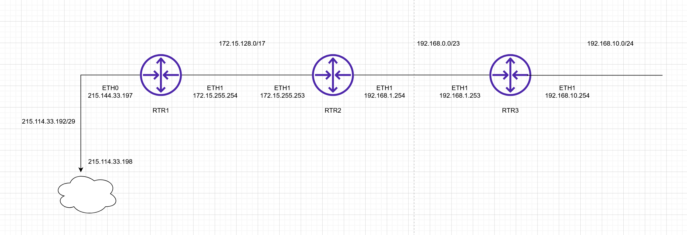

# Routing

## 1. Szenario

## RTR1

| Netzwerkziel | Netzwerkmaske | Interface/Gateway |
| ------------ | ------------- | ----------------- |
| 10.1.0.0     | 255.255.0.0   | ETH0              |
| 10.2.0.0     | 255.255.0.0   | ETH1              |
| 10.3.0.0     | 255.255.0.0   | 10.2.255.253      |

### RTR2

| Netzwerkziel | Netzwerkmaske | Interface/Gateway |
| ------------ | ------------- | ----------------- |
| 10.1.0.0     | 255.255.0.0   | 10.2.255.254      |
| 10.2.0.0     | 255.255.0.0   | ETH0              |
| 10.3.0.0     | 255.255.0.0   | ETH1              |

## 2. Szenario

| Netzwerkziel  | Netzwerkmaske   | Interface/Gateway |
| ------------- | --------------- | ----------------- |
| 192.168.1.0   | 255.255.255.192 | ETH0              |
| 192.168.1.64  | 255.255.255.192 | ETH1              |
| 192.168.1.128 | 255.255.255.128 | ETH2              |
| 192.15.98.224 | 255.255.255.252 | ETH3              |
| 0.0.0.0       | 0.0.0.0         | 202.15.98.226     |

## 3. Szenario

