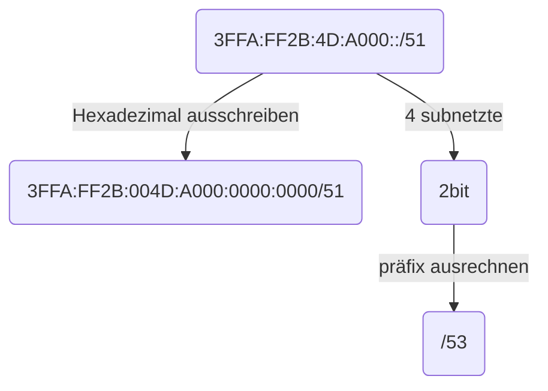
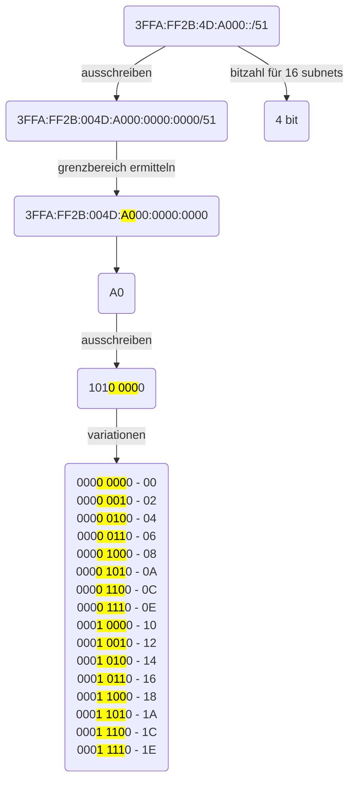

# IPv6 Subnetting

[Aufgabe](https://bkes-hamm.de/iserv/fs/file/local/Groups/Klasse%20ITB2/FRA/EVP-LF9%20-%20Netzwerke%20und%20Dienste%20bereitstellen/LS%209.1%20-%20Routing/IPv6-Subnetting%20-%20AB1.pdf)

## Aufgabe 1

Ihre Firma hat vom ISP das Netz 3FFA:FF2B:4D:A000::/51 zugewiesen bekommen. Teilen  
Sie dieses Netz in 4 Subnetze auf.

0000 0000

000 0 0000

101<mark>0 0</mark> 000

- 1010 0000 | A0

- 1010 1000 | A8

- 1011 0000 | B0

- 1011 1000 | B8

vier Subnetze:

- 3FFA:FF2B:004D:A000:0000:0000/53

- 3FFA:FF2B:004D:A800:0000:0000/53

- 3FFA:FF2B:004D:B000:0000:0000/53

- 3FFA:FF2B:004D:B800:0000:0000/53

## Aufgabe 2

