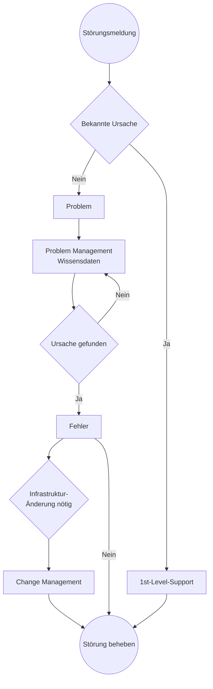

```mermaid
graph TD;
A((Störungsmeldung))-->B{Bekannte Ursache};
B-->|Ja|C[1st-Level-Support];
B-->|Nein|D[Problem];
D-->E[Problem Management <br>Wissensdaten];
E-->F{Ursache gefunden};
F-->|Nein|E;
F-->|Ja|G[Fehler];
G-->H{Infrastruktur- <br>Änderung nötig};
H-->I[Change Management];
I-->J((Störung beheben));
G-->|Nein|J;
C-->J;
```
